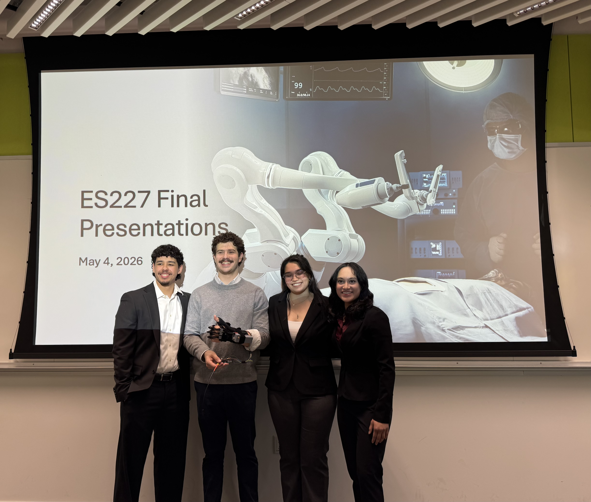
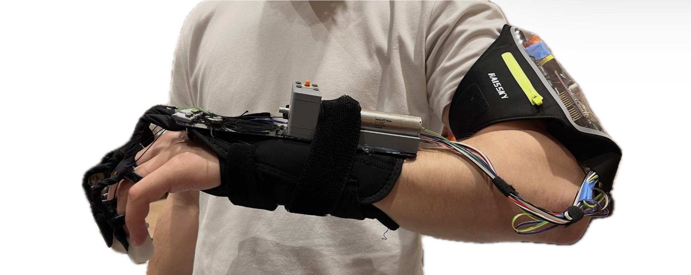
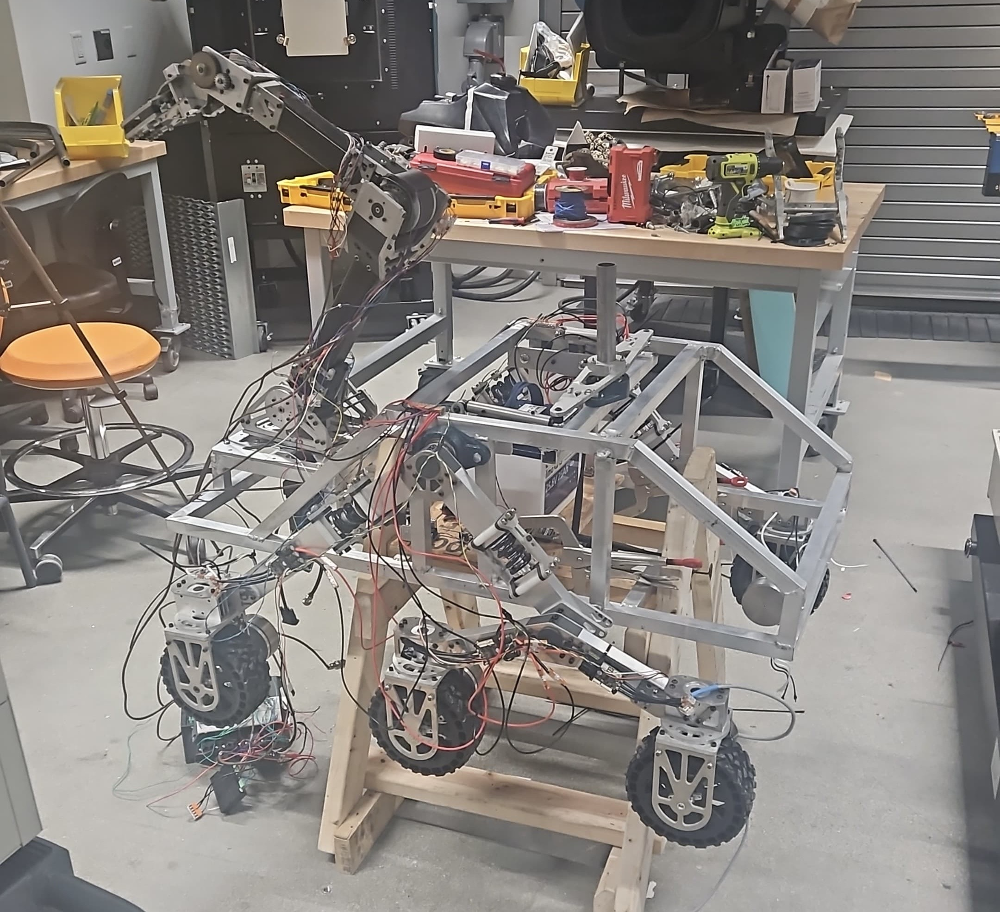
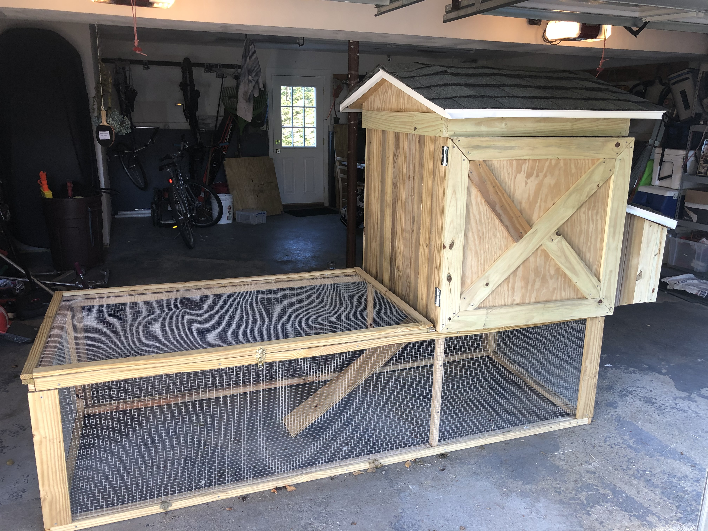

# Jackson's Engineering Portfolio

## Marblehead, MA | Harvard University class of 2027 | B.S. in Mechanical Engineering

  <em>ES227 final project presentation — pictured second from left, holding our prototype.</em>

### About Me
Hello. My name is Jackson Selby and I am a senior at Harvard University pursuing a Bachelor of Science in Mechanical Engineering. I love solving problems creatively with math, physics, and engineering principles, and I thrive off of seeing a project through design, fabrication, testing, and iteration to a successful final product that I can be proud of. After graduation, my goal is to build new and innovative cutting-edge aerospace systems and other deep-tech systems to continue tackling demanding problems and create solutions that will have a real-world impact. 

### Resume and LinkedIn

<a href="Documents/Jackson_Selby_Resume.pdf" target="_blank">Jackson's Resume</a>

<a href="https://www.linkedin.com/in/jackson-selby-53587b30b" target="_blank">LinkedIn</a>

### Unofficial Transcript and Plan Of Study

<a href="Documents/UnofficialTranscript.pdf" target="_blank">Unofficial Transcript Spring 2026 </a>

<a href="Documents/PlanOfStudy.pdf" target="_blank"> Senior Year Plan of Study </a>

## Projects

<a href="Projects/ES227 Portfolio Page.pdf" target="_blank">ES227 Medical Device Design Project</a>

<a href="Projects/ES 227 Final Paper.pdf" target="_blank">ES227 Final Paper</a>

<a href="Projects/ES227 Final Presentation.pdf" target="_blank">ES227 Presentation</a>

Graduate design class in which students were tasked to research, design, and fabricate a novel medical device. Semester long project culminated in a live demo design fair and a presentation for professors, providers, patients, etc. 

<a href="Projects/ES220.pdf" target="_blank">ES220 Fluid Dynamics Across Scales Project</a>

<a href="Projects/ES220_Final_Project_Report__Copy_ (1).pdf" target="_blank">ES220 Final Paper</a>

<a href="Projects/ES220_FinalPres .pdf" target="_blank">ES220 Presentation</a>

Graduate fluids class culminating in a final project and presentation. Project topics were pitched to professor and intended for students to explore a particular aspect of fluid mechanics more deeply and teach the rest of the class about what they had learned.

<a href="Projects/Robotics Club Portfolio.pdf" target="_blank"> Harvard Undergraduate Robotics Club</a>

One of the first few members of the Harvard Undergraduate Robotics Club (HURC), helping to brainstorm and design system modules for the planned Mars rover competition. Later took on a manufacturing role as one of the few machine shop trained members. 

### Early Projects 

<a href="Projects/Carpentry Portfolio.pdf" target="_blank"> Covid Chicken Coop Project </a>

Designed and built a Chicken coop for 4 backyard chickens during Covid. Materials were purchased from Home Depot and then later, when something larger was desired, the coop was sold on Craigslist

<a href="Projects/Miscellaneous Project.pdf" target="_blank"> Miscellaneous Projects </a>

A few smaller projects and assignments from throughout my time in college meant to demonstrate proficiency and understanding of modeling application and techniques

## Work Experience 
#### Production Test Engineering Intern - Pratt and Whitney

  June through August 2026 I worked as a Production Test Engineering Intern (PTE) at Pratt and Whitney in Middletown, CT. I provided test stand coverage for over 75 engines in 4 different models, communicating with operators to execute certain test profiles, and analyzing engine test data to determine whether parameters were within set quality, ship, and health and safety limits. I was also responsible for troubleshooting tripped engine faults and various abnormal running conditions which required a halt of the test, determining how to proceed, and reviewing the final shipping documents before the engine and relevant test parameters were shipped to the customer.

### PW1900G Data Analysis Project

  Along with these daily coverage duties, I worked on an individual project to streamline PW1900G test data analysis. After learning how to code in proprietary Unigraph software, I adapted PW1100G quality curve and test instruction sheet (TIS) files to be applicable to the new PW1900G model. This included implementing quality curve equations for the given parameters as determined by the quality data analysis team. It also included figuring out ways to graph the ship limits, and health and safety limits required by the TIS. Many of these limits were specific to the PW1900G and so new and creative ways were needed to figure out how to plot them. In total, 22 quality assurance curves and 40+ TIS limits were coded, and uploaded to the master code via GitHub, dramatically reducing the required time to analyze PW1900G test data. 

  <em>
Due to the proprietary nature of the project, technical data and imagery cannot be included
  </em>

