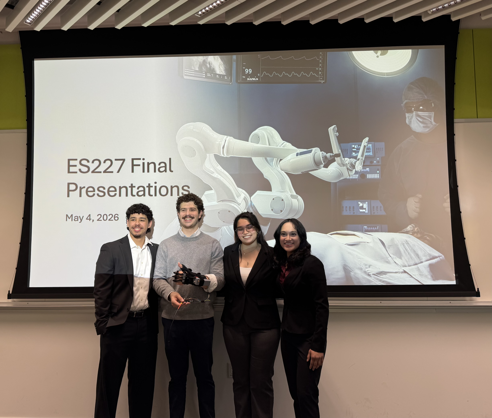

# Jackson's Engineering Portfolio

## Marblehead, MA | Harvard University class of 2027 | B.S. in Mechanical Engineering

### About Me
Hello. My name is Jackson Selby and I am a senior at Harvard University pursuing a Bachelor’s of Science in Mechanical Engineering. I love solving problems creatively with math, physics, and engineering principles, and I thrive off of seeing a project through design, fabrication, testing, and itertion to a successful final product that I can be proud of. after graduation, my goal is to buid new and innovative cutting-edge aerospace systems and other deep-tech systems to continue tackling demanding problems and create solutions that will have a real-world impact. 

## Resume and LinkedIn

<a href="Documents/Jackson_Selby_Resume.pdf" target="_blank">Jackson's Resume</a>

<a href="https://www.linkedin.com/in/jackson-selby-53587b30b" target="_blank">LinkedIn</a>

## Unofficial Transcript and Plan Of Study

<a href="Documents/UnofficialTranscript.pdf" target="_blank">Unofficial Transcript Spring 2026 </a>

<a href="Documents/PlanOfStudy.pdf" target="_blank"> Senior Year Plan of Study </a>

